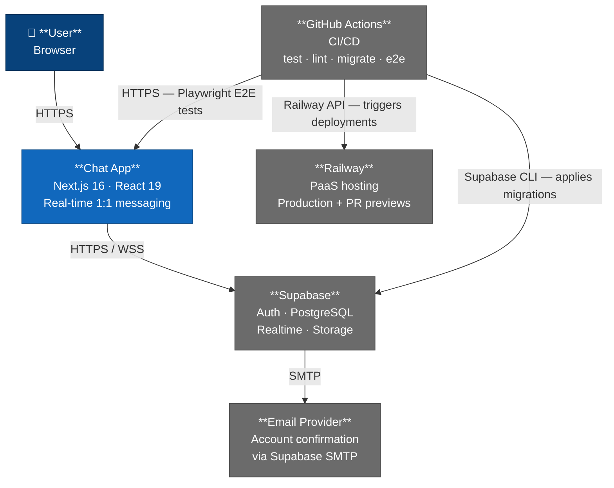
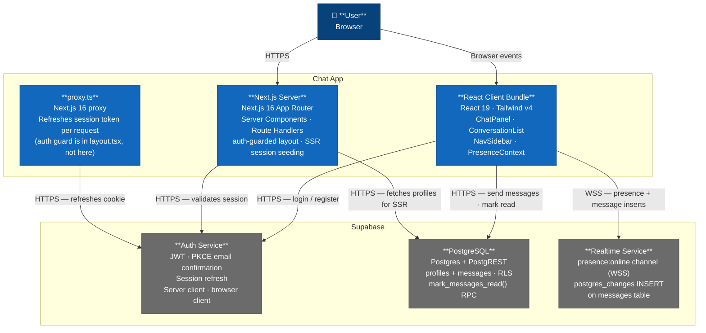

# C4 Architecture Diagrams — Chat App

> C1 (System Context) and C2 (Container) diagrams per the C4 model (Simon Brown).
> C3 component and C4 code diagrams are available on request.

---

## Bounded Contexts

| Context | Responsibility | Key files |
|---|---|---|
| **Auth** | Login, register, session lifecycle, email confirmation | `app/(auth)/`, `app/auth/callback/route.ts`, `proxy.ts`, `lib/supabase/` |
| **Messaging** | Send/receive messages, read receipts, realtime delivery | `app/(chat)/chat/[username]/`, `hooks/useMessages.ts`, `components/chat/` |
| **Presence** | Online/offline status, realtime tracking | `context/PresenceContext.tsx`, `hooks/usePresence.ts` |
| **Profiles** | User profiles, avatars, display names, username-based routing | `app/(chat)/layout.tsx` (SSR fetch), `components/nav/`, `components/conversations/` |

---

## C1 — System Context

---

## C2 — Container Diagram

---

## Key Architectural Notes

- **Two Supabase clients, never swapped** — `createBrowserClient` (singleton, Client Components) vs `createServerClient` with `await cookies()` (Server Components / Route Handlers). See CLAUDE.md.
- **Realtime channel singleton** — `supabase.channel()` reuses channels by topic in the browser singleton. PresenceContext owns the single `presence:online` channel. Multiple components calling `supabase.channel('presence:online')` causes "cannot add presence callbacks after subscribe()". See ADR-001.
- **Realtime cleanup** — `channel.teardown() + (supabase.realtime as any)._remove(channel)` instead of `supabase.removeChannel()`. The official API is async and leaves the channel in the internal array long enough for React Strict Mode's double-invoke. See ADR-005.
- **Auth guard location** — Route protection is in `app/(chat)/layout.tsx` (Server Component), not in `proxy.ts`. The proxy only refreshes the token.
